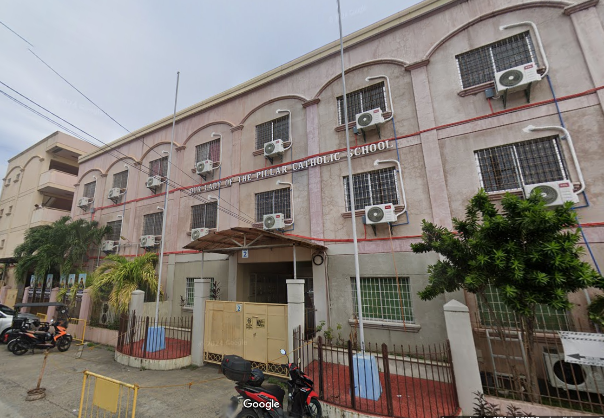

<!DOCTYPE html>
<html lang="en">
<head>
  <meta charset="UTF-8" />
  <meta name="viewport" content="width=device-width, initial-scale=1.0" />
  <title>Portfolio Website</title>
  <!-- Font Awesome for icons -->
  <link rel="stylesheet" href="https://cdnjs.cloudflare.com/ajax/libs/font-awesome/6.5.0/css/all.min.css">

  
</head>

<body>

  

    <button class="nav-button" onclick="showSection('home')">Home</button>
    <button class="nav-button" onclick="showSection('education')">Education</button>
    <button class="nav-button" onclick="showSection('about')">About Me</button>
    <button class="nav-button" onclick="showSection('contact')">Contact</button>
  

  <section id="home" class="section active">
    
    <h1>Hello, it's Eunice</h1>
    <h3 class="typing-text">Hello! Welcome to my personal website.</h3>
    

      <a href="mailto:eunice.rodriguez0430@gmail.com"><i class="fa-solid fa-envelope"></i></a>
      <a href="https://www.facebook.com/share/1BpYRNrsa3/" target="_blank">
      <i class="#"><i class="fa-brands fa-facebook"></i>
      </a>      
      <a href=https://www.instagram.com/eunice_rdrgz/" target="_blank">
      <i class="#"><i class="fa-brands fa-instagram"></i>
      </a>

    

  </section>

  <section id="education" class="section">
    <h2>Education</h2>
    
    

    <h1>Our Lady of the Pillar Catholic School, Inc. </h1>
    
F. Tirona Street, Poblacion II-A, City of Imus, Cavite 

    
Nursery (2008 - 2009)  
       Kinder (2009 - 2010)  
       Preparatory (2010 - 2011)  
       Elementary (2011 - 2017)  
       Junior High School (2017 - 2021)  
       Senior High School (2021 - 2023) 

    

   
    

    <h1>Imus Institute of Science and Technology, Inc. </h1> 
    
82 Nueno Avenue, City of Imus, Cavite  

    
College (2023 - Present)

    

  </section>

  <section id="about" class="section">
    <h2>About Me</h2>
    
    

    

    
Name: Rodriguez, Eunice Valencia  
       Age: 20 years old  
       Birthday: April 30, 2004  
       Gender: Female  
       Dream: To be a Certified Public Accountant  
       Favorite Color: Purple  
       Favorite Artist/Band: BTS  
       Favorite Song: Mikrokosmos and Zero O’Clock by BTS  
       Favorite Series: 18 Again, Still 17, and Reply 1988  
       Hobbies: Listening to music, watching k-dramas, and sleeping  
       Favorite Bible Verse:  
       “For I know the plans I have for you, plans to prosper you and  
       not to harm you, plans to give you hope and a future.”  
       - Jeremiah 29:11  
       Achievements:

    

  </section>

  <section id="contact" class="section">
    <h2>Contact</h2>
    

    

    
Email me at eunice.rodriguez0430@gmail.com

    
Facebook: Eunice Rodriguez 

   

  </section>

  

</body>
</html>
